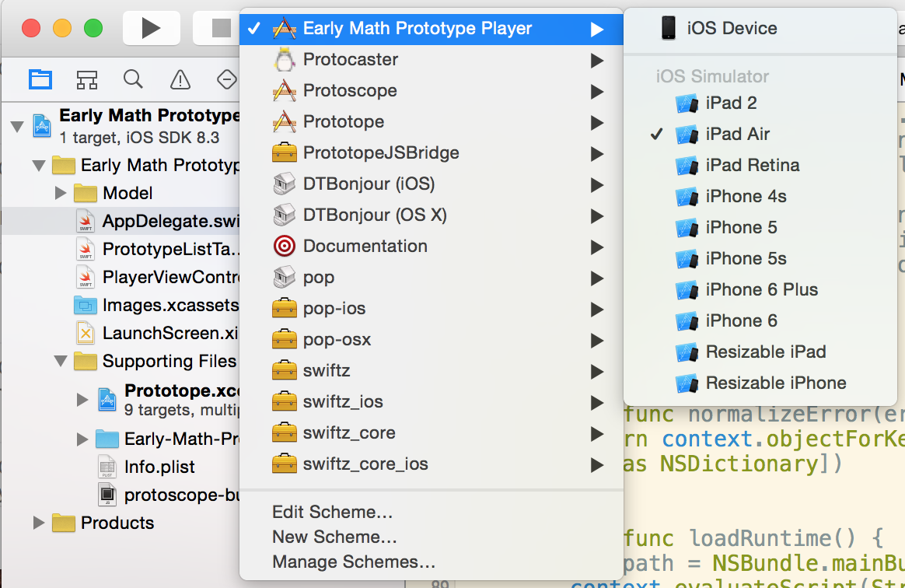

# Early-Math-Prototype-Player
Play the Early Math Prototypes embedded in an iPad app.

Running the app on your iPad:

- Get Xcode from the Mac App Store if you don't already have it
- Clone this git repository to your computer.
    - If you're not familiar with git, you can use the Github app to do it.
    - Alternatively, you can do the following from the Terminal app
            
            git clone --recursive git@github.com:Khan/Early-Math-Prototype-Player.git
- Open the project file (Early Math Prototype Player.xcodeproj) in Xcode
- Make sure you pick the correct app to run and device in Xcode if it's not already chosen.

- Build and run the app on your Simulator or iPad.

## Navigating

To navigate back to the list of prototypes, swipe to the right with three fingers. If you're using the simulator, you can also press Escape.
